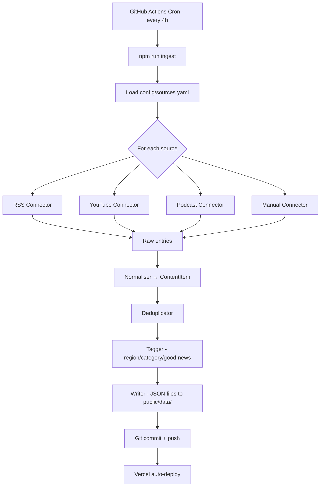
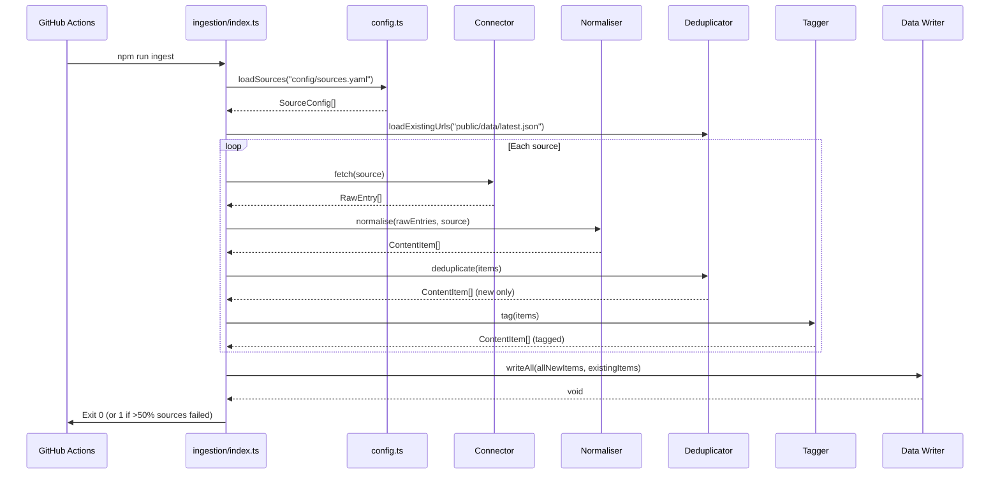

# Design Document: Automated Ingestion

## Overview

The Automated Ingestion system is a TypeScript Node.js pipeline that runs as a scheduled GitHub Actions job every 4 hours. It fetches content from Gambian media sources (newspapers, YouTube channels, podcasts, manual links), normalises entries into the existing `ContentItem` schema, deduplicates against existing data, applies region/category/good-news tagging via keyword rules, and writes JSON files to `public/data/` for the static Next.js frontend to consume. A git commit + push triggers Vercel to rebuild and deploy.

### Design Decisions

1. **No cloud infrastructure** — The pipeline runs entirely in a GitHub Actions runner using Node.js. No AWS services (Lambda, SQS, EventBridge) are needed. This keeps the system simple, free, and transparent.
2. **Sequential processing** — Sources are processed sequentially within a single Node.js process to simplify error handling, rate limiting, and logging. With ~20 sources running every 4 hours, parallelism is unnecessary.
3. **Git as state store** — The `public/data/` JSON files committed to the repo serve as both the content database and deployment artifact. No separate database is needed.
4. **Deterministic IDs** — Content item IDs are generated from a SHA-256 hash of the normalised original URL, ensuring idempotent deduplication across runs.
5. **Fail-forward per source** — A failing source never blocks other sources. The run summary reports successes and failures.

## Architecture

### Data Flow Diagram



### Sequence Diagram



## Components and Interfaces

### Directory Structure

```
ingestion/
├── index.ts              # Main entry point (npm run ingest)
├── config.ts             # Load and validate sources.yaml
├── types.ts              # Internal types (RawEntry, SourceConfig, etc.)
├── connectors/
│   ├── index.ts          # Connector registry/factory
│   ├── rss.ts            # RSS/Atom feed connector
│   ├── youtube.ts        # YouTube channel connector
│   ├── podcast.ts        # Podcast RSS connector
│   └── manual.ts         # Manual links connector
├── pipeline/
│   ├── normalise.ts      # Raw → ContentItem
│   ├── deduplicate.ts    # URL-based dedup
│   ├── tagger.ts         # Region + category + good-news tagging
│   └── writer.ts         # Write JSON output files
├── utils/
│   ├── logger.ts         # Structured JSON logging
│   ├── rate-limit.ts     # Per-domain rate limiting
│   └── hash.ts           # Deterministic ID generation (SHA-256)
└── tests/
    ├── normalise.test.ts
    ├── deduplicate.test.ts
    ├── tagger.test.ts
    └── writer.test.ts
```

### Core Interfaces

```typescript
// ingestion/types.ts

/** Source definition from config/sources.yaml */
export interface SourceConfig {
  id: string;
  name: string;
  connectorType: 'rss' | 'youtube' | 'podcast' | 'manual';
  url?: string;               // Feed URL or channel URL
  channelId?: string;         // YouTube channel ID
  manualFile?: string;        // Path to manual entries JSON
  region?: Region;            // Default region override
  isOfficialSource?: boolean; // Whether this is a government source
  contentType?: ContentType;  // Override content type
}

/** Raw entry produced by connectors before normalisation */
export interface RawEntry {
  title: string;
  link: string;
  publishedAt?: string;       // ISO 8601 or parseable date string
  author?: string;
  description?: string;
  thumbnailUrl?: string;
  embedUrl?: string;
  duration?: string;          // Podcast duration
}

/** Connector interface — all connectors implement this */
export interface Connector {
  fetch(source: SourceConfig): Promise<RawEntry[]>;
}

/** Tagging configuration loaded from sources.yaml */
export interface TaggingConfig {
  regionKeywords: Record<Region, string[]>;
  categoryKeywords: Record<Category, string[]>;
  goodNewsKeywords: string[];
}

/** Output file wrapper matching frontend expectations */
export interface DataFile {
  items: ContentItem[];
  meta: {
    generatedAt: string;   // ISO 8601
    count: number;
  };
}
```

### Connector Interface

Each connector is a pure function that takes a `SourceConfig` and returns `RawEntry[]`. Failures are caught at the connector level and return empty arrays with logged errors.

```typescript
// connectors/index.ts
export function getConnector(type: SourceConfig['connectorType']): Connector {
  switch (type) {
    case 'rss': return rssConnector;
    case 'youtube': return youtubeConnector;
    case 'podcast': return podcastConnector;
    case 'manual': return manualConnector;
  }
}
```

### RSS Connector

- Uses `rss-parser` package (already handles RSS 2.0 and Atom)
- Falls back to `fast-xml-parser` if `rss-parser` fails on malformed feeds
- Extracts: title, link, pubDate, creator/author, content:encoded snippet
- Applies rate limiting via `utils/rate-limit.ts`
- Sets User-Agent header: `TheSmilingCoastHub/1.0 (+https://thesmilingcoasthub.com)`

### YouTube Connector

- If `YOUTUBE_API_KEY` env var is set: uses YouTube Data API v3 `/search` endpoint
- If no API key: falls back to YouTube's public RSS feed at `https://www.youtube.com/feeds/videos.xml?channel_id={channelId}`
- Extracts: title, videoId (→ URL), publishedAt, thumbnail, description
- Sets `embedUrl` to `https://www.youtube.com/embed/{videoId}`
- Sets `contentType` to `"video"`

### Podcast Connector

- Reuses `rss-parser` with custom fields configured for iTunes/podcast extensions
- Extracts: title, link (enclosure or guid), pubDate, author, itunes:duration, itunes:summary
- Always sets `contentType` to `"podcast"`

### Manual Connector

- Reads a JSON file from the path specified in `source.manualFile`
- Validates each entry has `title`, `originalUrl`, `publishedAt`
- Skips invalid entries with a warning log
- Used for sources without machine-readable feeds

## Data Models

### Source Configuration (config/sources.yaml)

```yaml
sources:
  - id: the-standard
    name: The Standard Newspaper
    connectorType: rss
    url: https://standard.gm/feed/
    isOfficialSource: false

  - id: grts-tv
    name: GRTS TV
    connectorType: youtube
    channelId: UC_GRTS_CHANNEL_ID
    isOfficialSource: true
    contentType: video

  - id: kerr-fatou-podcast
    name: Kerr Fatou Podcast
    connectorType: podcast
    url: https://anchor.fm/s/kerr-fatou/podcast/rss
    isOfficialSource: false

  - id: state-house
    name: State House
    connectorType: manual
    manualFile: config/manual/state-house.json
    isOfficialSource: true

tagging:
  regionKeywords:
    banjul: [Banjul, State House, National Assembly, Supreme Court]
    kanifing: [Kanifing, Serrekunda, Bakau, Fajara, Pipeline]
    west-coast: [Brikama, Kartong, Gunjur, Sanyang, Tanji]
    north-bank: [Barra, Kerewan, Farafenni, North Bank]
    lower-river: [Mansakonko, Soma, Lower River]
    central-river: [Janjanbureh, Georgetown, Kuntaur, Central River]
    upper-river: [Basse, Fatoto, Upper River]

  categoryKeywords:
    politics: [election, parliament, National Assembly, president, minister, opposition, coalition, vote, constitution, IEC]
    business: [investment, dalasi, economy, trade, market, tourism, agriculture, bank, GDP, employment]
    technology: [digital, tech, internet, software, broadband, ICT, fintech, startup]
    sports: [Scorpions, football, AFCON, FIFA, GFF, basketball, wrestling, athletics]
    diaspora: [diaspora, abroad, remittance, overseas Gambians, returnees]

  goodNewsKeywords:
    - achievement
    - milestone
    - record
    - launch
    - opens
    - invest
    - graduate
    - award
    - breakthrough
    - growth
    - success
    - partnership
    - donation
    - scholarship
```

### ContentItem Schema (existing — from src/types/content.ts)

The normaliser maps `RawEntry` + `SourceConfig` → `ContentItem`:

| RawEntry field | ContentItem field | Transformation |
|---|---|---|
| — | `id` | SHA-256 hash of normalised `link` |
| `title` | `title` | Trim whitespace |
| `description` | `summary` | Truncate to 280 chars |
| source config | `sourceId` | From `SourceConfig.id` |
| source config | `sourceName` | From `SourceConfig.name` |
| source config | `sourceUrl` | From `SourceConfig.url` |
| `link` | `originalUrl` | As-is |
| `publishedAt` | `publishedAt` | Parse to ISO 8601, fallback to `collectedAt` |
| — | `collectedAt` | Current timestamp (ISO 8601) |
| tagger | `region` | Keyword match, default `"banjul"` |
| tagger | `categories` | Keyword match, default `[]` |
| source config | `contentType` | From config or inferred |
| `thumbnailUrl` | `thumbnailUrl` | As-is or `null` |
| `author` | `author` | As-is or `null` |
| — | `language` | Default `"en"` |
| tagger | `isGoodNews` | Keyword match |
| source config | `isOfficialSource` | From config |
| `embedUrl` | `embedUrl` | As-is or `null` |
| — | `status` | Always `"published"` |

### Deduplication Strategy

1. On startup, load all existing items from `public/data/latest.json`
2. Build a `Set<string>` of normalised URLs (lowercase, no trailing slash, no query params)
3. For each new `ContentItem`, normalise its `originalUrl` and check against the set
4. Discard items whose URL is already in the set
5. Add accepted URLs to the set for intra-run deduplication

**URL normalisation function:**
```typescript
function normaliseUrl(url: string): string {
  const parsed = new URL(url);
  parsed.search = '';           // Remove query params
  let path = parsed.pathname;
  if (path.endsWith('/') && path.length > 1) {
    path = path.slice(0, -1);  // Remove trailing slash
  }
  parsed.pathname = path;
  return parsed.toString().toLowerCase();
}
```

### JSON Output Format

All files follow the same wrapper structure matching the existing `public/data/latest.json`:

```typescript
{
  "items": ContentItem[],
  "meta": {
    "generatedAt": "2025-07-28T15:00:00Z",
    "count": 27
  }
}
```

**Output files written per run:**

| File | Contents |
|---|---|
| `public/data/latest.json` | All items, sorted by `publishedAt` desc |
| `public/data/trending.json` | Top 20 items from most-active sources in last 24h |
| `public/data/good-news.json` | Items where `isGoodNews === true` |
| `public/data/dates/YYYY-MM-DD.json` | Items grouped by publish date |
| `public/data/regions/{region}.json` | Items grouped by region |
| `public/data/categories/{category}.json` | Items grouped by category |
| `public/data/sources/{sourceId}.json` | Items grouped by source |

### Trending Algorithm

"Trending" identifies stories gaining attention from multiple outlets:

1. Filter all items to the last 24 hours
2. Group items by a "story cluster" — for v1, simply select items from the highest number of distinct `sourceId` values within the 24h window
3. Sort by `publishedAt` descending
4. Cap at 20 items


## Correctness Properties

*A property is a characteristic or behavior that should hold true across all valid executions of a system — essentially, a formal statement about what the system should do. Properties serve as the bridge between human-readable specifications and machine-verifiable correctness guarantees.*

### Property 1: Source config validation rejects invalid entries

*For any* source configuration entry missing one or more required fields (id, name, connectorType), the config validator SHALL reject it and return a validation error, while entries with all required fields SHALL pass validation.

**Validates: Requirements 1.2, 5.2, 5.3**

### Property 2: Normalisation produces valid ContentItem

*For any* valid RawEntry and SourceConfig pair, the normaliser SHALL produce a ContentItem where: `status` is `"published"`, `language` is `"en"` (when no language detected), `sourceId` matches the config's `id`, `sourceName` matches the config's `name`, `originalUrl` matches the raw entry's `link`, and `contentType` matches the source config's type (or `"podcast"` for podcast connectors).

**Validates: Requirements 6.1, 6.5, 6.6, 14.3, 4.4**

### Property 3: Deterministic ID generation

*For any* URL string, hashing it SHALL always produce the same ID (idempotence), and *for any* two distinct normalised URLs, their generated IDs SHALL be different (collision resistance for practical purposes).

**Validates: Requirements 6.2**

### Property 4: Summary truncation

*For any* input description string of arbitrary length, the normalised summary field SHALL have length ≤ 280 characters, and if the original description is ≤ 280 characters, the summary SHALL equal the original (trimmed).

**Validates: Requirements 6.3, 14.1**

### Property 5: ContentItem JSON round-trip

*For any* valid ContentItem object, serialising to JSON via `JSON.stringify` then parsing back via `JSON.parse` SHALL produce an object deeply equal to the original.

**Validates: Requirements 6.8**

### Property 6: URL-based deduplication with normalisation

*For any* set of ContentItems where some share the same URL (differing only in case, trailing slashes, or query parameters), the deduplicator SHALL produce a result set where no two items have the same normalised URL, and all retained items SHALL be from the original (earlier) set.

**Validates: Requirements 7.1, 7.2, 7.4, 7.5**

### Property 7: Region tagging from keywords

*For any* ContentItem whose title or summary contains a keyword from the region keyword mapping, the tagger SHALL assign the corresponding region. *For any* ContentItem whose title and summary contain no region keywords, the tagger SHALL assign the default region `"banjul"`.

**Validates: Requirements 8.1, 8.5**

### Property 8: Category tagging from keywords

*For any* ContentItem whose title or summary contains keywords from category keyword mappings, the tagger SHALL include all matching categories in the `categories` array. *For any* ContentItem whose title and summary contain no category keywords, the tagger SHALL assign an empty `categories` array.

**Validates: Requirements 8.2, 8.6**

### Property 9: Good-news classification is bidirectional

*For any* ContentItem whose title or summary contains at least one positive-sentiment keyword, the tagger SHALL set `isGoodNews` to `true`. *For any* ContentItem whose title and summary contain no positive-sentiment keywords, the tagger SHALL set `isGoodNews` to `false`.

**Validates: Requirements 15.1, 15.2**

### Property 10: Official source flag propagation

*For any* ContentItem produced from a source with `isOfficialSource: true` in its config, the resulting item SHALL have `isOfficialSource` set to `true`.

**Validates: Requirements 8.7**

### Property 11: Writer sorting invariant

*For any* set of ContentItems written to `latest.json`, the output items array SHALL be sorted by `publishedAt` in descending order (newest first).

**Validates: Requirements 9.1**

### Property 12: Writer grouping correctness

*For any* set of ContentItems, after writing grouped files: (a) every item in `dates/YYYY-MM-DD.json` SHALL have that date as its publish date, (b) every item in `regions/{region}.json` SHALL have that region, (c) every item in `categories/{category}.json` SHALL include that category in its categories array, (d) every item in `good-news.json` SHALL have `isGoodNews === true`, and (e) every item in `sources/{sourceId}.json` SHALL have that sourceId. No items SHALL be lost — the union of all grouped files SHALL contain all original items (each item appears in at least one group per dimension).

**Validates: Requirements 9.2, 9.3, 9.4, 9.5, 9.6**

### Property 13: Output file structure

*For any* output JSON file produced by the writer, the file SHALL parse to an object with exactly two top-level keys: `"items"` (an array) and `"meta"` (an object with `generatedAt` as a valid ISO 8601 string and `count` equal to `items.length`).

**Validates: Requirements 9.7, 9.8**

### Property 14: Writer JSON round-trip

*For any* set of ContentItems, writing them to a JSON file then reading and parsing that file SHALL produce an array deeply equal to the original items.

**Validates: Requirements 9.9**

### Property 15: Trending file invariants

*For any* set of ContentItems, the trending output SHALL: (a) contain only items published within the last 24 hours, (b) contain at most 20 items, and (c) be sorted by `publishedAt` descending.

**Validates: Requirements 16.1, 16.2, 16.3**

### Property 16: Failure isolation

*For any* run where a subset of sources fail, all non-failing sources SHALL still produce their items in the output. The pipeline SHALL exit with non-zero status if and only if more than 50% of configured sources fail.

**Validates: Requirements 11.2, 11.4**

## Error Handling

### Strategy: Fail-Forward Per Source

The pipeline uses a "fail-forward" pattern — individual source failures are logged and isolated, never blocking the remaining pipeline.

### Error Categories

| Error Type | Handling | Retries |
|---|---|---|
| HTTP timeout/unreachable | Log ERROR, return empty RawEntry[] | 2 retries with exponential backoff |
| HTTP 429 (rate limited) | Log WARN, skip domain for remainder of run | 0 (respect rate limit) |
| HTTP 4xx/5xx | Log ERROR, return empty RawEntry[] | 2 retries |
| XML/JSON parse error | Log ERROR with raw snippet, return empty | 0 (malformed data won't fix itself) |
| Config validation error | Log ERROR, skip source | 0 |
| File write error | Log ERROR, throw (fatal — cannot produce output) | 0 |
| URL parse error | Log WARN, skip individual item | 0 |

### Retry Logic

```typescript
async function withRetry<T>(
  fn: () => Promise<T>,
  maxRetries: number = 2,
  baseDelayMs: number = 1000
): Promise<T> {
  let lastError: Error;
  for (let attempt = 0; attempt <= maxRetries; attempt++) {
    try {
      return await fn();
    } catch (err) {
      lastError = err as Error;
      if (attempt < maxRetries) {
        await sleep(baseDelayMs * Math.pow(2, attempt));
      }
    }
  }
  throw lastError!;
}
```

### Exit Codes

| Code | Meaning |
|---|---|
| 0 | Success — all or most sources processed |
| 1 | Partial failure — >50% of sources failed |

### Graceful Degradation

- If `config/sources.yaml` is missing or unparseable → exit immediately with clear error
- If `public/data/latest.json` is missing → start fresh (empty existing set)
- If a connector returns 0 items for a source that previously had items → log WARN (may indicate upstream issue) but proceed

## Testing Strategy

### Property-Based Testing (PBT)

**Library:** `fast-check` (already installed in the project as a devDependency)

**Configuration:**
- Minimum 100 iterations per property test
- Each test tagged with `Feature: automated-ingestion, Property {N}: {title}`
- Tests run via `vitest --run` as part of CI

**Vitest config extension** — Add ingestion test paths:
```typescript
include: ["src/**/*.test.{ts,tsx}", "tests/**/*.test.{ts,tsx}", "ingestion/**/*.test.ts"]
```

### Test File Layout

| Test File | Properties Covered |
|---|---|
| `ingestion/tests/normalise.test.ts` | Properties 2, 3, 4, 5 |
| `ingestion/tests/deduplicate.test.ts` | Property 6 |
| `ingestion/tests/tagger.test.ts` | Properties 7, 8, 9, 10 |
| `ingestion/tests/writer.test.ts` | Properties 11, 12, 13, 14, 15 |
| `ingestion/tests/config.test.ts` | Property 1 |
| `ingestion/tests/pipeline.test.ts` | Property 16 |

### Unit Tests (Example-Based)

In addition to property tests, targeted unit tests cover:
- Connector factory returns correct type (Req 1.3)
- YouTube connector uses API when key present, falls back when absent (Req 3.3, 3.4)
- Rate limiter enforces 2-second gap (Req 12.1)
- User-Agent header is set correctly (Req 12.2)
- Structured log output format (Req 17.1–17.4)
- RSS connector handles HTTP errors and malformed XML (Req 2.3, 2.4)

### Integration Tests

- Full pipeline run against mock feeds (local HTTP server with fixture RSS/Atom/JSON)
- Config loading from YAML file
- Writer output matches expected file structure

### CI Integration

Property tests and unit tests run on every PR via existing `npm run test` (vitest). The ingestion tests are included in the vitest glob pattern. No separate CI step is needed — they run alongside existing tests.
