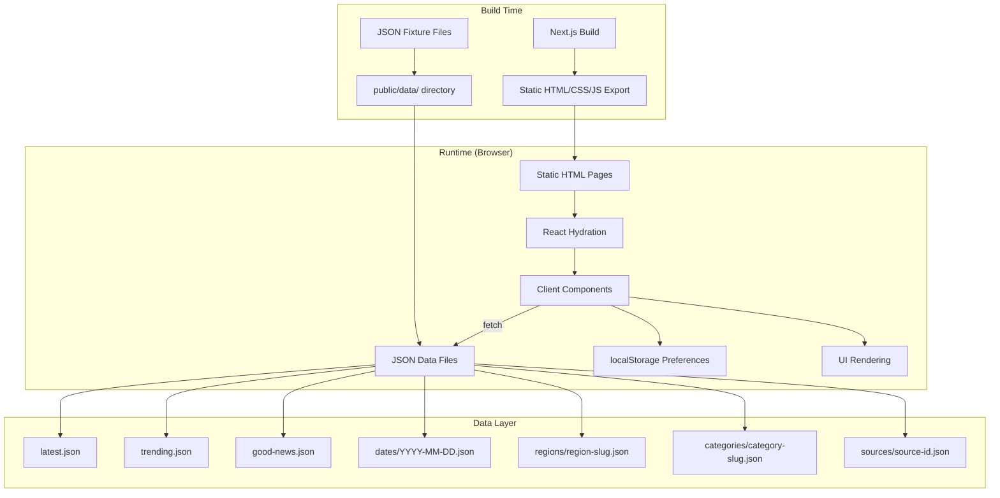
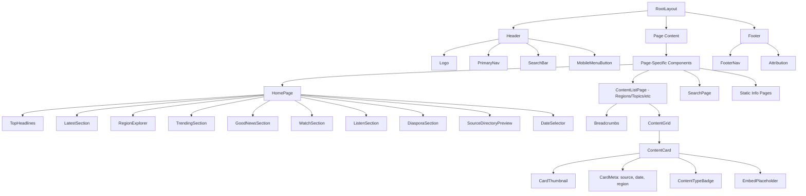
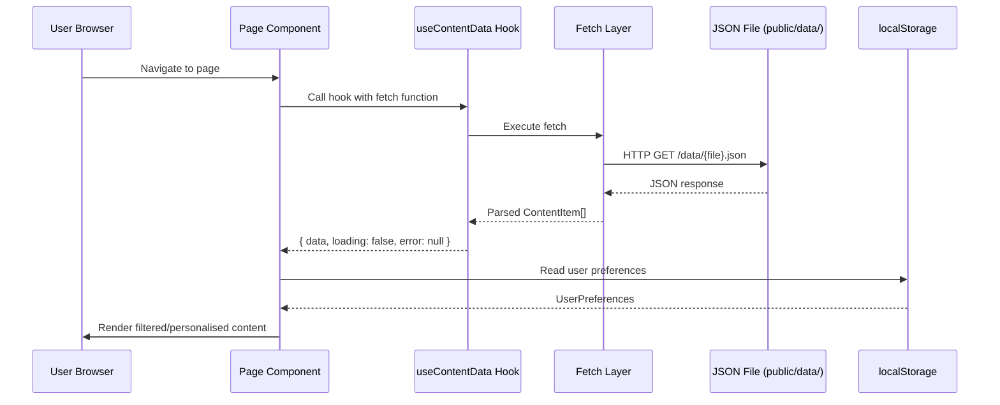
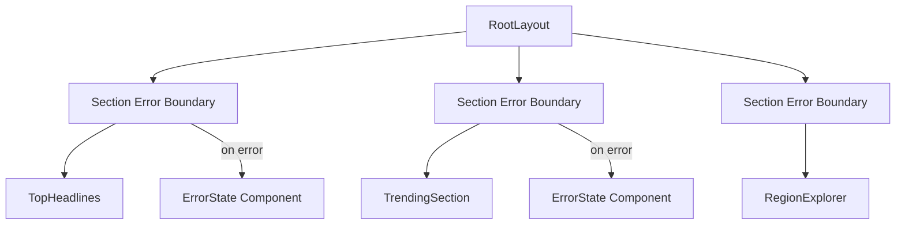

# Design Document: The Smiling Coast Hub — Phase 1 MVP

## Overview

The Smiling Coast Hub Phase 1 MVP is a statically exported Next.js application that aggregates and presents Gambian news and media content from local JSON fixture files. The application renders a mobile-first, accessible interface with multiple content views (by region, topic, date, content type) and supports anonymous user preferences via localStorage.

### Key Design Decisions

1. **Static Export Architecture**: Next.js `output: "export"` produces a fully pre-rendered HTML/CSS/JS bundle deployable to any static file server (S3/CloudFront in Phase 3). No server runtime needed.

2. **Client-Side Data Fetching**: JSON files in `public/data/` are fetched at runtime via `fetch()` from the client. Since static export cannot use `getServerSideProps`, all data loading happens in React components using client-side patterns.

3. **Component-Driven UI**: A shared `ContentCard` component and composable section components ensure consistent rendering across all pages.

4. **Anonymous Preferences**: localStorage provides persistence for user preferences without authentication. The system degrades gracefully when storage is unavailable.

5. **Performance-First**: Lazy loading, code splitting via Next.js dynamic imports, embed placeholders for third-party content, and optimised images ensure fast load times on 3G connections.

## Architecture

### High-Level Architecture Diagram



### Application Layers

```
┌─────────────────────────────────────────────────┐
│                  Pages (App Router)              │
│  layout.tsx, page.tsx for each route             │
├─────────────────────────────────────────────────┤
│              Feature Components                  │
│  HomeSections, RegionView, TopicView, etc.      │
├─────────────────────────────────────────────────┤
│              Shared UI Components               │
│  ContentCard, Navigation, SearchBar, etc.       │
├─────────────────────────────────────────────────┤
│              Data Layer (lib/)                   │
│  fetchContent, filterContent, searchContent     │
├─────────────────────────────────────────────────┤
│           Preferences Layer (lib/)              │
│  usePreferences hook, PreferenceProvider        │
├─────────────────────────────────────────────────┤
│              Type Definitions                   │
│  ContentItem, Source, Preference schemas        │
└─────────────────────────────────────────────────┘
```

### Routing Structure (App Router)

```
src/app/
├── layout.tsx                    # Root layout (nav, footer, providers)
├── page.tsx                      # Homepage (/)
├── not-found.tsx                 # Custom 404
├── latest/
│   └── page.tsx                  # /latest
├── regions/
│   ├── page.tsx                  # /regions (overview)
│   └── [slug]/
│       └── page.tsx              # /regions/[slug]
├── topics/
│   ├── page.tsx                  # /topics (overview)
│   └── [slug]/
│       └── page.tsx              # /topics/[slug]
├── watch/
│   └── page.tsx                  # /watch
├── listen/
│   └── page.tsx                  # /listen
├── good-news/
│   └── page.tsx                  # /good-news
├── diaspora/
│   └── page.tsx                  # /diaspora
├── archive/
│   ├── page.tsx                  # /archive
│   └── [date]/
│       └── page.tsx              # /archive/[date]
├── sources/
│   ├── page.tsx                  # /sources
│   └── [id]/
│       └── page.tsx              # /sources/[id]
├── search/
│   └── page.tsx                  # /search
├── about/
│   └── page.tsx                  # /about
├── editorial-policy/
│   └── page.tsx                  # /editorial-policy
├── corrections/
│   └── page.tsx                  # /corrections
├── privacy/
│   └── page.tsx                  # /privacy
└── contact/
    └── page.tsx                  # /contact
```

### Static Export Configuration

For dynamic routes (`[slug]`, `[date]`, `[id]`), each page must export a `generateStaticParams()` function that returns all valid parameter combinations at build time. The data for these params is derived from the JSON fixture files.

```typescript
// Example: src/app/regions/[slug]/page.tsx
export function generateStaticParams() {
  return [
    { slug: 'banjul' },
    { slug: 'kanifing' },
    { slug: 'west-coast' },
    { slug: 'north-bank' },
    { slug: 'lower-river' },
    { slug: 'central-river' },
    { slug: 'upper-river' },
  ];
}
```

## Components and Interfaces

### Component Hierarchy



### Shared UI Component Library

| Component | Purpose | Props |
|-----------|---------|-------|
| `ContentCard` | Displays a single content item consistently | `item: ContentItem`, `variant?: 'compact' | 'featured' | 'media'` |
| `ContentGrid` | Responsive grid layout for content cards | `items: ContentItem[]`, `columns?: 1 | 2 | 3 | 4` |
| `ContentTypeBadge` | Visual indicator of content type | `type: ContentType` |
| `EmbedPlaceholder` | Deferred embed loader for video/audio | `embedUrl: string`, `thumbnailUrl?: string`, `title: string` |
| `EmptyState` | Informative message when no content available | `title: string`, `description: string`, `icon?: LucideIcon` |
| `ErrorState` | Error display with retry action | `message: string`, `onRetry?: () => void` |
| `LoadingSkeleton` | Content-appropriate loading placeholder | `variant: 'card' | 'list' | 'hero'`, `count?: number` |
| `SearchBar` | Text input with search icon | `onSearch: (term: string) => void`, `placeholder?: string` |
| `FilterBar` | Multi-criteria filter controls | `filters: FilterConfig[]`, `onFilterChange: (filters: ActiveFilters) => void` |
| `Breadcrumbs` | Hierarchical navigation trail | `items: BreadcrumbItem[]` |
| `DatePicker` | Date navigation for archive | `selectedDate: string`, `onDateChange: (date: string) => void` |
| `RegionCard` | Region overview link card | `region: RegionInfo` |
| `SourceCard` | Source directory entry | `source: SourceInfo` |
| `SectionHeader` | Consistent section title styling | `title: string`, `viewAllHref?: string` |
| `SkipLink` | Accessibility skip-to-content link | — |
| `MobileNav` | Hamburger menu navigation | `isOpen: boolean`, `onClose: () => void` |
| `PageMeta` | SEO head metadata component | `title: string`, `description: string`, `ogImage?: string` |

### Key Interfaces

```typescript
// src/types/content.ts
export type ContentType = 'article' | 'video' | 'podcast' | 'radio' | 'social' | 'official-update';

export type Region = 'banjul' | 'kanifing' | 'west-coast' | 'north-bank' | 'lower-river' | 'central-river' | 'upper-river';

export type Category = 'politics' | 'business' | 'technology' | 'sports' | 'diaspora';

export type ContentStatus = 'published' | 'developing' | 'corrected' | 'retracted';

export interface ContentItem {
  id: string;
  title: string;
  summary: string;
  sourceId: string;
  sourceName: string;
  sourceUrl: string;
  originalUrl: string;
  publishedAt: string; // ISO 8601
  collectedAt: string; // ISO 8601
  region: Region;
  categories: Category[];
  contentType: ContentType;
  thumbnailUrl: string | null;
  author: string | null;
  language: string;
  isGoodNews: boolean;
  isOfficialSource: boolean;
  embedUrl: string | null;
  status: ContentStatus;
}

// src/types/source.ts
export interface SourceInfo {
  id: string;
  name: string;
  description: string;
  websiteUrl: string;
  contentTypes: ContentType[];
  isOfficialSource: boolean;
  logoUrl: string | null;
}

// src/types/preferences.ts
export interface UserPreferences {
  preferredRegions: Region[];
  preferredCategories: Category[];
  hiddenCategories: Category[];
  recentlyViewed: string[]; // content item IDs
  savedStories: string[]; // content item IDs
  readingDuration: Record<string, number>; // item ID -> seconds
  trackingEnabled: boolean;
}

// src/types/filters.ts
export interface SearchFilters {
  query: string;
  region: Region | null;
  category: Category | null;
  contentType: ContentType | null;
  sourceId: string | null;
  dateFrom: string | null;
  dateTo: string | null;
}

export interface FilterConfig {
  id: string;
  label: string;
  type: 'select' | 'date' | 'daterange';
  options?: { value: string; label: string }[];
}

export interface ActiveFilters {
  [filterId: string]: string | null;
}
```

### Data Fetching Layer

```typescript
// src/lib/data.ts
export async function fetchContentList(path: string): Promise<ContentItem[]>;
export async function fetchLatest(): Promise<ContentItem[]>;
export async function fetchTrending(): Promise<ContentItem[]>;
export async function fetchGoodNews(): Promise<ContentItem[]>;
export async function fetchByRegion(slug: Region): Promise<ContentItem[]>;
export async function fetchByCategory(slug: Category): Promise<ContentItem[]>;
export async function fetchByDate(date: string): Promise<ContentItem[]>;
export async function fetchBySource(sourceId: string): Promise<ContentItem[]>;
export async function fetchSources(): Promise<SourceInfo[]>;

// src/lib/search.ts
export function searchContent(items: ContentItem[], query: string): ContentItem[];
export function filterContent(items: ContentItem[], filters: SearchFilters): ContentItem[];
export function sortByDate(items: ContentItem[], order?: 'asc' | 'desc'): ContentItem[];

// src/lib/preferences.ts
export function getPreferences(): UserPreferences;
export function setPreferences(prefs: Partial<UserPreferences>): void;
export function resetPreferences(): void;
export function isStorageAvailable(): boolean;
```

### Custom Hooks

```typescript
// src/lib/hooks/useContentData.ts
export function useContentData(fetchFn: () => Promise<ContentItem[]>): {
  data: ContentItem[];
  loading: boolean;
  error: string | null;
  retry: () => void;
};

// src/lib/hooks/usePreferences.ts
export function usePreferences(): {
  preferences: UserPreferences;
  updatePreferences: (partial: Partial<UserPreferences>) => void;
  resetPreferences: () => void;
  isAvailable: boolean;
};

// src/lib/hooks/useSearch.ts
export function useSearch(allContent: ContentItem[]): {
  results: ContentItem[];
  resultCount: number;
  query: string;
  filters: SearchFilters;
  setQuery: (q: string) => void;
  setFilters: (f: Partial<SearchFilters>) => void;
  clearAll: () => void;
};
```

## Data Models

### JSON Data File Schemas

All JSON data files follow the same pattern: an array of `ContentItem` objects (or in the case of sources, `SourceInfo` objects).

**Content List Files** (`latest.json`, `trending.json`, `good-news.json`, `dates/*.json`, `regions/*.json`, `categories/*.json`):

```json
{
  "items": [
    {
      "id": "art-001",
      "title": "National Assembly Passes New Budget Bill",
      "summary": "The National Assembly approved the 2024 budget allocation with focus on education and healthcare spending...",
      "sourceId": "the-standard",
      "sourceName": "The Standard",
      "sourceUrl": "https://standard.gm",
      "originalUrl": "https://standard.gm/article/budget-bill-2024",
      "publishedAt": "2024-01-15T09:30:00Z",
      "collectedAt": "2024-01-15T10:00:00Z",
      "region": "banjul",
      "categories": ["politics"],
      "contentType": "article",
      "thumbnailUrl": "/images/thumbnails/budget-bill.jpg",
      "author": "Fatou Jallow",
      "language": "en",
      "isGoodNews": false,
      "isOfficialSource": false,
      "embedUrl": null,
      "status": "published"
    }
  ],
  "meta": {
    "generatedAt": "2024-01-15T10:00:00Z",
    "count": 1
  }
}
```

**Source Files** (`sources/{source-id}.json`):

```json
{
  "source": {
    "id": "the-standard",
    "name": "The Standard",
    "description": "The Gambia's leading independent newspaper covering politics, business, and society.",
    "websiteUrl": "https://standard.gm",
    "contentTypes": ["article"],
    "isOfficialSource": false,
    "logoUrl": "/images/sources/the-standard.png"
  },
  "items": []
}
```

### localStorage Preference Schema

Key: `smiling-coast-hub-preferences`

```json
{
  "preferredRegions": ["banjul", "kanifing"],
  "preferredCategories": ["politics", "technology"],
  "hiddenCategories": [],
  "recentlyViewed": ["art-001", "vid-003"],
  "savedStories": ["art-005"],
  "readingDuration": { "art-001": 120 },
  "trackingEnabled": true
}
```

The preference system uses a versioned schema to handle future migrations:

```typescript
const PREFERENCE_KEY = 'smiling-coast-hub-preferences';
const PREFERENCE_VERSION = 1;

interface StoredPreferences {
  version: number;
  data: UserPreferences;
}
```

### Data Flow Diagram



## Design System

### Colour Palette (Tailwind Design Tokens)

```typescript
// tailwind.config.ts — theme.extend.colors
const colors = {
  // Primary Backgrounds
  'surface': {
    DEFAULT: '#FAFAF8',     // Warm white page background
    card: '#FFFFFF',         // Card background
    muted: '#F5F3EF',       // Subtle section backgrounds
  },
  // Primary Text
  'ink': {
    DEFAULT: '#1A2332',     // Dark navy — primary text
    muted: '#4A5568',       // Charcoal — secondary text
    light: '#718096',       // Light grey — captions
  },
  // Gambian Flag Accents
  'gambia': {
    red: '#CE1126',         // Red band — alerts, breaking, live
    blue: '#0C1C8C',        // Blue band — links, interactive
    green: '#3A7728',       // Green band — good news, success
  },
  // Supplementary
  'sand': {
    DEFAULT: '#D4A843',     // Warm gold — highlights, badges
    light: '#F5E6C8',       // Light sand — hover backgrounds
  },
  // Semantic
  'error': '#DC2626',
  'warning': '#F59E0B',
  'success': '#3A7728',
  'info': '#0C1C8C',
};
```

### Typography Scale

```typescript
// tailwind.config.ts — theme.extend.fontSize
const fontSize = {
  'display':  ['2.5rem', { lineHeight: '1.1', fontWeight: '800' }],   // Hero headlines
  'h1':       ['2rem', { lineHeight: '1.2', fontWeight: '700' }],     // Page titles
  'h2':       ['1.5rem', { lineHeight: '1.3', fontWeight: '700' }],   // Section headers
  'h3':       ['1.25rem', { lineHeight: '1.4', fontWeight: '600' }],  // Card titles
  'body':     ['1rem', { lineHeight: '1.6', fontWeight: '400' }],     // Body text
  'body-sm':  ['0.875rem', { lineHeight: '1.5', fontWeight: '400' }], // Small body
  'caption':  ['0.75rem', { lineHeight: '1.4', fontWeight: '500' }],  // Captions, labels
};
```

Font stack: `Inter` for UI text, with system font fallback: `'Inter', ui-sans-serif, system-ui, -apple-system, sans-serif`.

### Spacing Scale

Uses Tailwind's default 4px-based spacing scale with these custom semantic tokens:

```typescript
const spacing = {
  'section': '3rem',       // Between major page sections (48px)
  'card-gap': '1.5rem',   // Between cards in a grid (24px)
  'card-pad': '1.25rem',  // Internal card padding (20px)
  'nav-height': '4rem',   // Fixed nav height (64px)
};
```

### Border Radius and Shadows

```typescript
const borderRadius = {
  'card': '0.75rem',       // 12px — cards and containers
  'badge': '9999px',       // Full round — badges and pills
  'button': '0.5rem',      // 8px — buttons
};

const boxShadow = {
  'card': '0 1px 3px rgba(26, 35, 50, 0.08), 0 1px 2px rgba(26, 35, 50, 0.04)',
  'card-hover': '0 4px 12px rgba(26, 35, 50, 0.12)',
  'nav': '0 2px 8px rgba(26, 35, 50, 0.06)',
};
```

### Responsive Breakpoints

Follows Tailwind defaults with mobile-first approach:
- `sm`: 640px (large phones)
- `md`: 768px (tablets)
- `lg`: 1024px (laptops)
- `xl`: 1280px (desktops)

Content grid behaviour:
- Mobile (< 640px): 1 column
- `sm`: 1–2 columns
- `md`: 2–3 columns
- `lg`: 3–4 columns

### Icon Usage

Lucide Icons for all iconography. Key mappings:

| Context | Icon |
|---------|------|
| Article | `FileText` |
| Video | `Play` / `Video` |
| Podcast | `Headphones` |
| Radio | `Radio` |
| Social | `Share2` |
| Official Update | `Building2` |
| Good News | `Heart` / `Smile` |
| Search | `Search` |
| Region | `MapPin` |
| Category | `Tag` |
| Date | `Calendar` |
| External Link | `ExternalLink` |
| Error | `AlertTriangle` |
| Empty | `Inbox` |

## Correctness Properties

*A property is a characteristic or behavior that should hold true across all valid executions of a system — essentially, a formal statement about what the system should do. Properties serve as the bridge between human-readable specifications and machine-verifiable correctness guarantees.*

### Property 1: Content Filtering Correctness

*For any* array of ContentItems and *any* valid filter criterion (region, category, contentType, or boolean field like isGoodNews), applying that filter shall return only items that satisfy the criterion, and no items that satisfy the criterion shall be excluded.

**Validates: Requirements 3.5, 3.6, 3.7, 3.8, 4.3, 5.3, 6.1, 6.2, 7.1, 21.1**

### Property 2: Content Sorting Preserves Date Order

*For any* array of ContentItems with distinct publishedAt timestamps, sorting by date descending shall produce a list where each item's publishedAt is greater than or equal to the next item's publishedAt.

**Validates: Requirements 3.4, 22.1**

### Property 3: Search and Filter Composition

*For any* array of ContentItems, *any* search query string, and *any* combination of active filters (region, category, contentType, source, date range), the results shall contain only items that match BOTH the text query (against title and summary, case-insensitive) AND all active filter criteria simultaneously. No matching item shall be excluded.

**Validates: Requirements 9.2, 9.4, 9.5**

### Property 4: ContentCard Rendering Completeness

*For any* valid ContentItem, rendering the ContentCard component shall produce output containing the item's title, truncated summary, sourceName, a formatted publishedAt date, a region indicator, a contentType indicator, and a link to the originalUrl.

**Validates: Requirements 4.4, 5.4, 16.2, 16.3, 16.4, 17.1, 17.5**

### Property 5: Summary Truncation

*For any* string of any length, the truncateSummary function shall return a string of at most 280 characters (plus ellipsis indicator if truncated). If the input is 280 characters or fewer, it shall be returned unchanged.

**Validates: Requirements 16.1, 17.4**

### Property 6: Embed Placeholder for Media Items

*For any* ContentItem where contentType is "video", "podcast", or "radio" and embedUrl is non-null, rendering the ContentCard shall produce an EmbedPlaceholder (no iframe loaded) rather than an auto-loading embed.

**Validates: Requirements 6.3, 13.2, 17.3**

### Property 7: Preference Storage Round-Trip

*For any* valid UserPreferences object, storing it via setPreferences and then retrieving it via getPreferences shall produce an object deeply equal to the original.

**Validates: Requirements 14.1**

### Property 8: Preference-Based Content Exclusion

*For any* array of ContentItems, *any* set of hidden categories, and *any* set of preferred regions, applying preference-based filtering shall: (a) exclude all items whose categories intersect with hidden categories, and (b) include items from preferred regions with higher priority. No item from a hidden category shall appear in the filtered output.

**Validates: Requirements 14.3, 14.4**

### Property 9: Date Formatting Consistency

*For any* valid ISO 8601 date string, the formatDate function shall produce a non-empty, human-readable string that does not contain the raw ISO format (no "T" separator or "Z" suffix).

**Validates: Requirements 8.6**

### Property 10: Date Navigation Arithmetic

*For any* valid date string in YYYY-MM-DD format, getNextDate shall return the following calendar day and getPreviousDate shall return the preceding calendar day, both in YYYY-MM-DD format. Applying getNextDate then getPreviousDate (or vice versa) shall return the original date.

**Validates: Requirements 8.3**

### Property 11: Data Fetch Error Resilience

*For any* fetch operation that results in a network error, HTTP 404, or malformed JSON response, the useContentData hook shall return an error state (error is non-null, data is empty array, loading is false) without throwing an unhandled exception.

**Validates: Requirements 1.5, 25.1, 25.3**

## Error Handling

### Strategy

Error handling follows a **graceful degradation** pattern where failures are isolated to individual sections, preventing cascading failures across the application.

### Error Boundary Architecture



### Error Types and Handling

| Error Type | Source | Handling |
|-----------|--------|----------|
| Network/Fetch failure | JSON file unavailable | Show ErrorState with retry button in affected section |
| JSON parse error | Malformed data file | Show ErrorState, log error to console |
| Missing data file (404) | File path incorrect | Show EmptyState with informative message |
| localStorage unavailable | Private browsing / full | Degrade to non-personalised mode silently |
| Invalid route | User types wrong URL | Custom 404 page with navigation suggestions |

### Implementation Pattern

```typescript
// Each section wraps data loading in try/catch with error state
function useContentData(fetchFn: () => Promise<ContentItem[]>) {
  const [state, setState] = useState<{
    data: ContentItem[];
    loading: boolean;
    error: string | null;
  }>({ data: [], loading: true, error: null });

  const load = useCallback(async () => {
    setState(prev => ({ ...prev, loading: true, error: null }));
    try {
      const result = await fetchFn();
      setState({ data: result, loading: false, error: null });
    } catch (err) {
      const message = err instanceof Error ? err.message : 'Failed to load content';
      console.error(`[SmCoastHub] Data fetch error: ${message}`);
      setState({ data: [], loading: false, error: message });
    }
  }, [fetchFn]);

  return { ...state, retry: load };
}
```

### Console Logging Convention

All client-side errors are logged with a `[SmCoastHub]` prefix for easy filtering:
- `[SmCoastHub] Data fetch error: {message}` — failed network requests
- `[SmCoastHub] Parse error: {message}` — JSON parsing failures
- `[SmCoastHub] Preference error: {message}` — localStorage issues

## Testing Strategy

### Testing Framework Stack

| Tool | Purpose |
|------|---------|
| **Vitest** | Unit and integration tests (fast, ESM-native) |
| **React Testing Library** | Component rendering and interaction tests |
| **fast-check** | Property-based testing library |
| **Playwright** | End-to-end browser tests |
| **axe-core** | Accessibility audit integration |

### Test Structure

```
tests/
├── unit/
│   ├── lib/
│   │   ├── data.test.ts          # Data fetching utilities
│   │   ├── search.test.ts        # Search and filter logic
│   │   ├── preferences.test.ts   # localStorage operations
│   │   └── dates.test.ts         # Date formatting and navigation
│   └── components/
│       ├── ContentCard.test.tsx   # Card rendering
│       ├── FilterBar.test.tsx     # Filter controls
│       └── EmbedPlaceholder.test.tsx
├── property/
│   ├── filtering.property.test.ts    # Property 1, 3, 8
│   ├── sorting.property.test.ts      # Property 2
│   ├── content-card.property.test.ts # Property 4, 5, 6
│   ├── preferences.property.test.ts  # Property 7, 8
│   ├── dates.property.test.ts        # Property 9, 10
│   └── resilience.property.test.ts   # Property 11
├── integration/
│   ├── homepage.test.tsx
│   ├── region-page.test.tsx
│   └── search-page.test.tsx
└── e2e/
    ├── navigation.spec.ts
    ├── search.spec.ts
    ├── preferences.spec.ts
    └── accessibility.spec.ts
```

### Property-Based Testing Configuration

- **Library**: `fast-check` (well-maintained, TypeScript-native)
- **Minimum iterations**: 100 per property test
- **Tag format**: `// Feature: smiling-coast-hub, Property {N}: {title}`

Each property test generates random ContentItem arrays, search queries, filter combinations, date strings, or preference objects to validate universal properties hold across the input space.

### Unit Test Balance

- **Property tests** cover: filtering logic, sorting, search, truncation, date arithmetic, preference storage, error resilience
- **Unit tests** (example-based) cover: specific rendering scenarios, edge cases (empty arrays, null fields), component interactions (click embed to load), accessibility attributes
- **E2E tests** cover: full page navigation, search workflow, preference persistence across page loads, 404 handling

### Test Fixtures

All test fixtures use realistic Gambian content — no Lorem Ipsum. A shared fixture factory generates ContentItem objects with:
- Real Gambian source names (The Standard, The Point, Foroyaa, GRTS)
- Plausible headlines about Gambian politics, business, sports
- Accurate region assignments
- Valid dates and URLs

### Accessibility Testing

- `vitest-axe` integration for component-level a11y checks
- Playwright axe-core audits on all pages during E2E
- Manual keyboard navigation verification documented in test plan
- Colour contrast verified against WCAG 2.1 AA via axe-core

### CI Integration

```yaml
# Test commands
npm run test          # Vitest unit + property tests
npm run test:e2e      # Playwright E2E tests
npm run lint          # ESLint + TypeScript checks
npm run build         # Verifies static export succeeds
```

